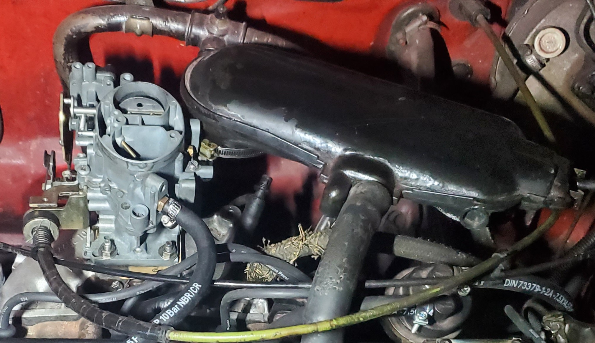
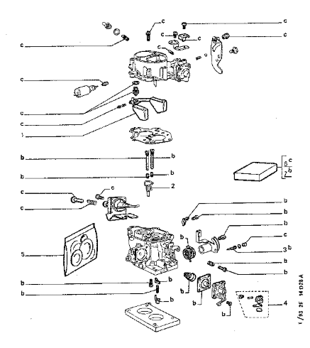
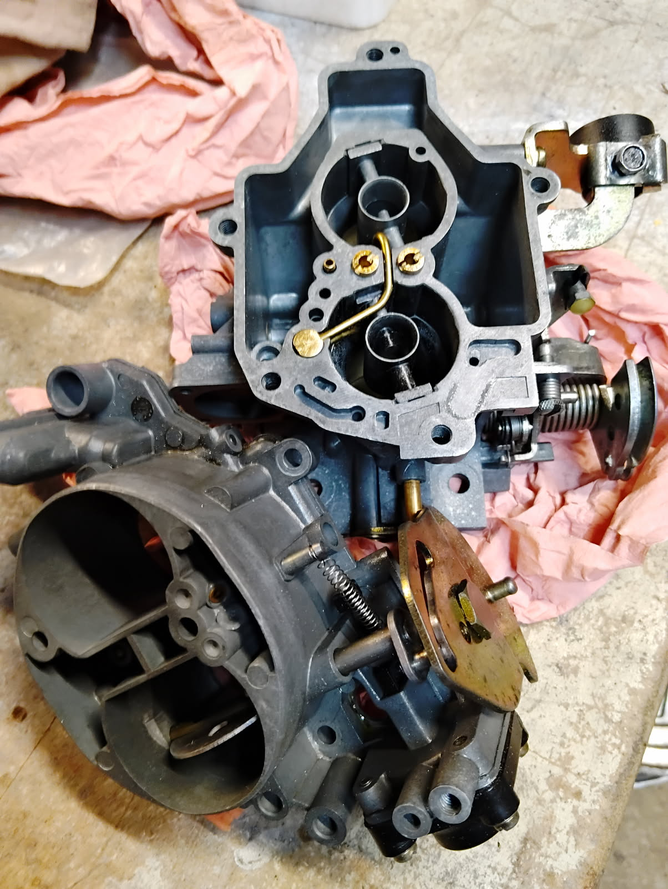

# Solex 32/34 Z2 - Repère 409 - Moteur TU3S

Ce carburateur, double corps inversé, à équipé les Peugeot 205 XS/GT/XT/CT (version 1.4L), les Peugeot 309 (avec le moteur TU3S repère K2A), et ce de 1987 (apparition des moteurs TU) jusqu'à 1992.

<td width="50%" valign="top">
  

    
  

</td>

## Tableau des calibrations

| Élément | 1er Corps | 2ème Corps |
| :--- | :--- | :--- |
| Buse (Venturi) | 24 | 27 |
| Gicleur principal | 117 | 130 |
| Ajutage d'automaticité | 27 155 | AZ 175 |
| Gicleur de ralenti | 45 |   |
| Enrichisseur Pneumatique |   |   |
| Gicleur d'éconostat |   | 120 |
| Injecteur pompe de reprise | 35 | 35 |
|ouverture positive | 20° |   |
| Entrebâillement volet de départ | 3 +- 0.5 |   |
| régime de ralenti | 750 |
| % de CO | 1.5 |
| % de CO2 mini | 12 |

## En quelques mots

  Ce carburateur Solex, comme ses homologues de la famille Z1 puis Z2 est un carbu progressif. C'est à dire que lorsqu'on roule tranquillement, à régime stabilisé, uniquement le premier corps est utilisé, le deuxième corps ne s'active que lorsque on appuie suffisamment fort sur la commande des gazs. Ce la permet d'être économe pour un usage "normal" tout en ayant la puissance du 2ème corps lorsque on a envie, pour un dépassement, une insertion sur autoroute ou lorsque l'esprit 205 turbo 16 evo 2 nous traverse l'esprit :).
Ce carburateur est équipé d'un starter manuelle et, étant donné la caractéristique "progressif" du carbu, seul le premier corps possède le volet de starter.

## Schéma du carburateur

<table width="100%">
  <tr>
    <td width="25%" valign="top">
      <b>Légende gauche</b>  
      - : filtre essence 
      - : etouffoir 
      - : Pointeau 
      - : Axe du flotteur 
      - : Tube d’émulsion 
      - : Gicleurs 
      - : Electrovanne clim 
      - : pochette de joint 
      - : vis de papillon       
    </td>

   <td width="50%" align="center" valign="top">
      
    </td>

   <td width="25%" valign="top">
      <b>Légende droite</b>  
      - : Vis de starter 
      - : Starter manuel 
      - : Gicleur de ralenti 
      - : Vis de commande de gaz 
      - : Vis de richesse avec joint 
     - : Vis de ralenti 
     - : Ensemble de la pompe de reprise
    </td>
  </tr>
</table>

## Carburateur séparé de sa partie haute
On peut voir les ajutages d'automaticité avec les tubes d'émulsions et les gicleurs en dessous. Il ne faut pas se tromper de sens, sur les tubes le coté droit (sur la photo) représente le 1er corps et le côté gauche le 2ème corps. Attention, sur la photo le carbu est à l'envers.

<td width="50%" valign="top">
  

    
  

</td>

