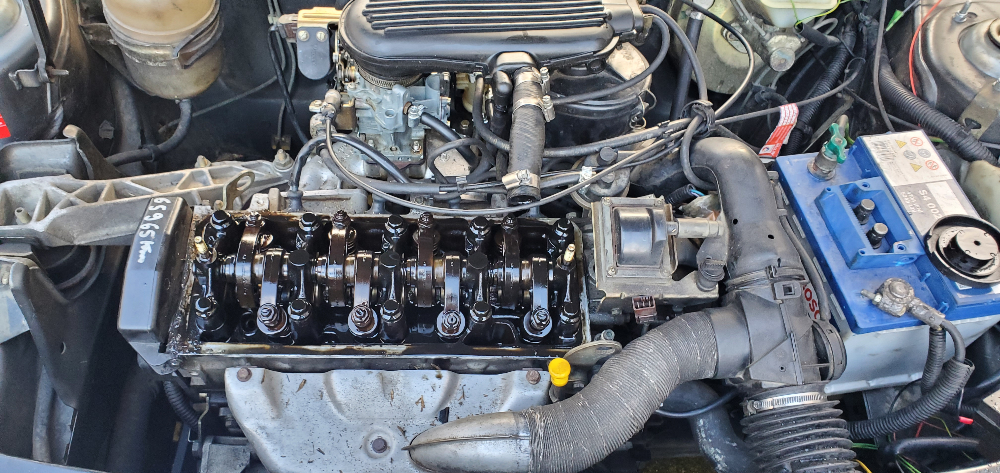

# Solex 32/34 Z2 - Repère 528 - Peugeot 205/309/106

Ce carburateur, double corps inversé, à équipé les Citroën ZX (version 1.4L), les Peugeot 309 (avec le moteur TU3F2/K repère K2D) ainsi que les Peugeot 205 GR/SR/XR en version 1.4L (TU3F2/K) de l'année 1992. Ce moteur remplace le TU3A de 70 ch équipé d'un carbu simple corps. C'est un bloc fonte (d'où le F dans le nom) et équipé d'un carbu double corps faisant grimper la puissance de 70 à 75ch (voir fiche technique des moteurs).

<td width="50%" valign="top">
  

    
  

</td>

On peut voir le carburateur en lieu et place dans la baie moteur, ici lors d'un changement de joint de cache culbuteur. On peut notifier aussi car la coiffe du carburateur (entre le carbu et le filtre) est différente selon le repère 528 et 409. En effet, sur les 528, la coiffe possède ces reliefs dessus, alors que sur un 409 d'origine, la coiffe est entièrement lisse (voir fiche du solex repère 409).

On peut également relevé la présence d'un petit bocal entre le carburateur et son filtre. C'est le retour d'essence. Il faut savoir que ce dispositif est arrivé uniquement sur la version 1992. Elle avait pour but de limiter le vapor lock (avec une réserve d'essence proche du carbu) et aussi de faire office de "régulateur" de pression, car la pompe amène l'essence dedans, le carburateur lui aspire ce qu'il à besoin et le surplus repart au réservoir.
Attention, le filtre plongé dans le réservoir à 2 robinet sur cette version (1 pour l'arrivée et 1 pour le retour) comparé à 1 seul robinet d'arrivée sur les autres version de TU (1987-1991). Par conséquent si vous voulez le rajouter sur votre 205 d'avant 1992, il faut le bocal ainsi que le filtre à 2 robinet du réservoir. C'est trouvable d'occasion uniquement sur des versions de 1992 naturellement.

## Tableau des calibrations

| Élément | 1er Corps | 2ème Corps |
| :--- | :--- | :--- |
| Buse (Venturi) | 24 | 25 |
| Gicleur principal | 120 | 12 |
| Ajutage d'automaticité | 6Z 175 | ZC 180 |
| Gicleur de ralenti | 40 |   |
| Enrichisseur Pneumatique | 45 |   |
| Gicleur d'éconostat |   | 80 |
| Injecteur pompe de reprise | 35 | 35 |
|ouverture positive (mm) | 0.5 |   |
| Entrebâillement volet de départ | 3 +- 0.5 |   |
| régime de ralenti | 750 +- 50 |
| % de CO | 1.5 +- 0.5 |

## Pièces de réfection
* [Commander la pochette de joints complète sur eBay](https://lien-affilie.com)
