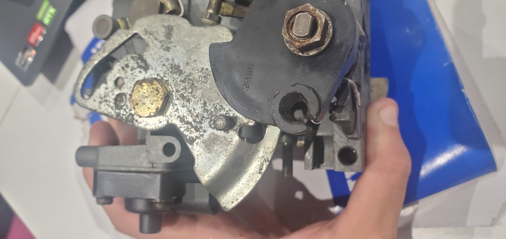
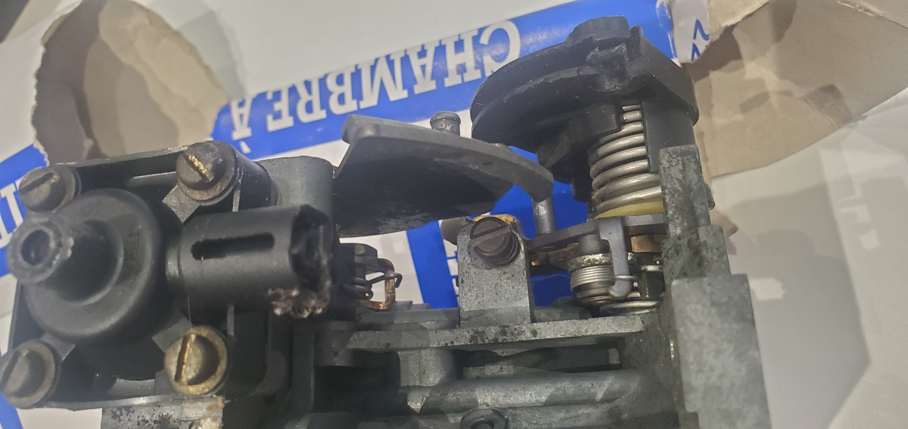

# Solex 32/34 Z2 - Repère 528 - Moteur TU3F2 - Peugeot

Ce carburateur, double corps inversé, à équipé les Citroën ZX (version 1.4L), les Peugeot 309 (avec le moteur TU3F2/K repère K2D) ainsi que les Peugeot 205 GR/SR/XR en version 1.4L (TU3F2/K) de l'année 1992. Ce moteur remplace le TU3A de 70 ch équipé d'un carbu simple corps. C'est un bloc fonte (d'où le F dans le nom) et équipé d'un carbu double corps faisant grimper la puissance de 70 à 75ch (voir fiche technique des moteurs).

<td width="50%" valign="top">
  

    
  

</td>

On peut voir le carburateur en lieu et place dans la baie moteur, ici lors d'un changement de joint de cache culbuteur. On peut notifier aussi car la coiffe du carburateur (entre le carbu et le filtre) est différente selon le repère 528 et 409. En effet, sur les 528, la coiffe possède ces reliefs dessus, alors que sur un 409 d'origine, la coiffe est entièrement lisse (voir fiche du solex repère 409).

On peut également relevé la présence d'un petit bocal entre le carburateur et son filtre. C'est le retour d'essence. Il faut savoir que ce dispositif est arrivé uniquement sur la version 1992. Elle avait pour but de limiter le vapor lock (avec une réserve d'essence proche du carbu) et aussi de faire office de "régulateur" de pression, car la pompe amène l'essence dedans, le carburateur lui aspire ce qu'il à besoin et le surplus repart au réservoir.
Attention, le filtre plongé dans le réservoir à 2 robinet sur cette version (1 pour l'arrivée et 1 pour le retour) comparé à 1 seul robinet d'arrivée sur les autres version de TU (1987-1991). Par conséquent si vous voulez le rajouter sur votre 205 d'avant 1992, il faut le bocal ainsi que le filtre à 2 robinet du réservoir. C'est trouvable d'occasion uniquement sur des versions de 1992 naturellement.

## Tableau des calibrations

| Élément | 1er Corps | 2ème Corps |
| :--- | :--- | :--- |
| Buse (Venturi) | 24 | 25 |
| Gicleur principal | 120 | 122 |
| Ajutage d'automaticité | 6Z 175 | ZC 180 |
| Gicleur de ralenti | 40 |   |
| Enrichisseur Pneumatique | 45 |   |
| Gicleur d'éconostat |   | 80 |
| Injecteur pompe de reprise | 35 | 35 |
|ouverture positive (mm) | 0.5 |   |
| Entrebâillement volet de départ | 3 +- 0.5 |   |
| régime de ralenti | 750 +- 50 |
| % de CO | 1.5 +- 0.5 |

## Schéma du carburateur

<table width="100%">
  <tr>
    <td width="25%" valign="top">
      <b>Légende gauche</b>  
      - : filtre essence 
      - : etouffoir 
      - : Pointeau 
      - : Axe du flotteur 
      - : Tube d’émulsion 
      - : Gicleurs 
      - : Electrovanne clim 
      - : pochette de joint 
      - : vis de papillon       
    </td>

   <td width="50%" align="center" valign="top">
      
    </td>

   <td width="25%" valign="top">
      <b>Légende droite</b>  
      - : Vis de starter 
      - : Starter manuel 
      - : Gicleur de ralenti 
      - : Vis de commande de gaz 
      - : Vis de richesse avec joint 
     - : Vis de ralenti 
     - : Ensemble de la pompe de reprise
    </td>
  </tr>
</table>

## Réglages

Pour régler un carburateur, il faut déjà avoir un allumage réglé (voir les spécifications), et qu'il n'y ai pas de prise d'air, sinon ce n'est pas la peine de tenter de le régler, ça ne marchera pas.
Une fois que ces 2 étapes sont faites, on peut s'attaquer au carburateur : 
1) la vis de richesse
2) la vis de ralenti

<table>
  <tr>
    <td width="50%" align="center" valign="top">
       
      <b>Emplacement de la vis de richesse (au fond du trou)</b>
    </td>
    <td width="50%" align="center" valign="top">
       
      <b>Emplacement de la vis de ralenti</b>
    </td>
  </tr>
</table>
   
En premier lieu, la vis de richesse n'est effective que lors du ralenti de la voiture, dès que on accélère, le carburateur tel que ce solex 32/34 Z2 va passer sur le circuit principal du 1er corps.
Dans l'idéal, il faut visser à fond (sans trop forcer) puis dévisser de 2 tours environ, ça c'est le réglage de base que on a tous entendu quelques part.
Je peux vous donner en conseil également c'est d'être très attentif à l'oreille, car en tournant cette vis de richesse, le régime moteur va soit monter soit chuter. L'idéal c'est de se mettre à l'endroit ou le régime est le plus haut.
Une fois cette étape terminer, on vient ré ajuster la vis de richesse pour avoir un ralenti vers 750-800 tours/minutes.

